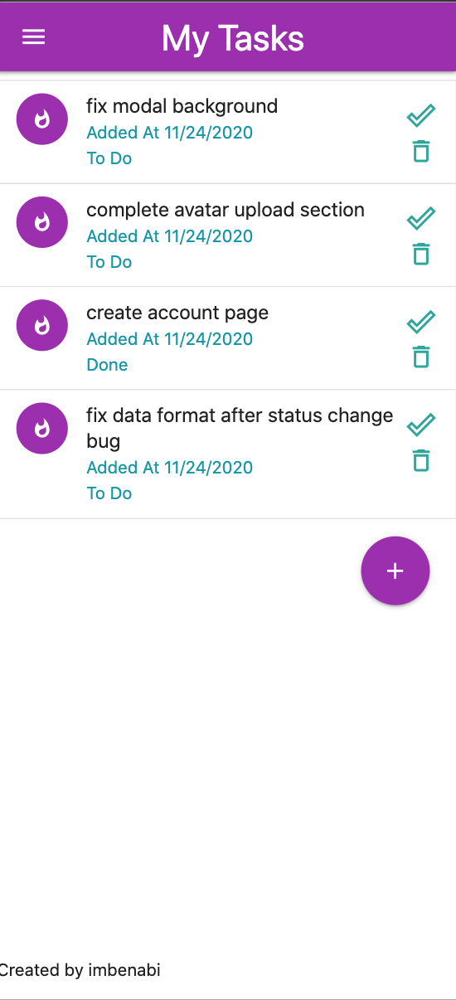
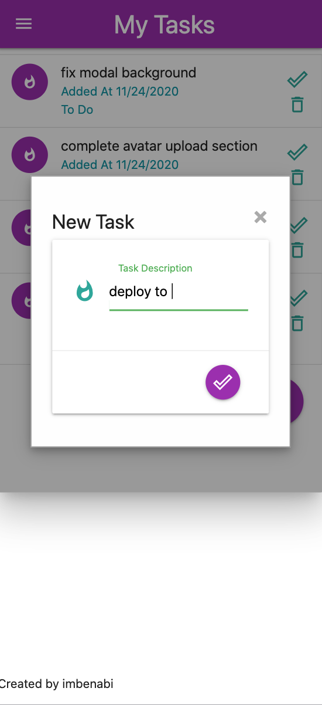

# Personal Task Manager
- Vanilla JS project.

## General description
- Task management web app.
- Express-MongoDB server.
- Some elements were implemented using SSR.
- UI by [Materialize](https://materializecss.com/).

## Start
- Run `npm run dev`.
- Go to localhost 3000 on your browser.

## App screenshots
<h1 align="center">
    
    
    
</h1>

## Roadmap
- Complete avatar upload support, currently only the backend supports it. 

